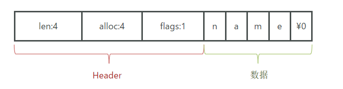
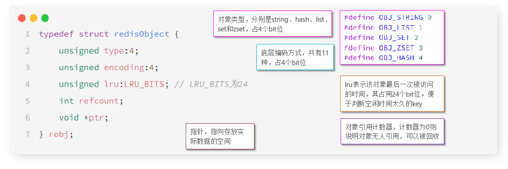

# 不屈日记

---
## 短信登录-redis项目

---
### session共享问题：

多台tomcat并不共享session存储空间，当请求切换到不同tomcat服务时，导致数据丢失问题。
替代方案：
> * 数据共享
> * 内存存储
> * key.value结构

---
### Redis替换session需要考虑的问题

> * 选择合适的数据结构
> * 选择合适的key
> * 选择合适的存储粒度

---

### 缓存

缓存就是数据交换的缓冲区，是存储数据的临时地方，一般读写性能较高
#### 作用

* 降低后端负载
* 提高读写效率，降低响应时间
#### 成本

* 数据一致性成本
* 代码维护成本
* 运维成本
---
### 缓存更新问题

 1                                                | 内存淘汰                                            | 超时剔除                             | 主动更新
--------------------------------------------|-------------------------------------------------|----------------------------------|----------------------------------
 说明| 不用自己维护，利用Redis的内存淘汰机制，当内存不足时自动淘汰部分数据。下次查询时更新缓存。 | 给缓存数据添加TTL时间，到期后自动删除缓存。下次查询时更新缓存 | 编写业务逻辑，在修改数据库的同时，更新缓存
 一致性| 差                                               | 一般                               | 好
维护成本| 无                                               | 低                                |高

业务场景：
+ 低一致性需求：使用内存淘汰机制。
+ 高一致性需求：主动更新，并以超时

---

### 缓存穿透

> 缓存穿透是指客户端请求的数据在缓存中和数据库中都不存在，这样缓存永远不会生效，这些请求都会打到数据库。  

缓存空对象：  
    优点：实现简单，维护方便  
    缺点：  
* 额外的内存消耗
* 可能造成短期的不一致

布隆过滤器：
* 优点：内存占用少，没有多余key
* 缺点：实现复杂，存在误判可能

### 缓存雪崩

> 缓存雪崩是指在同一时间段大量的缓存key同时失效或者Redis服务宕机，导致大量请求到达数据库，带来巨大压力

解决方案：
* 给不同的可以TTL添加随机值
* 利用redis集群提高服务的可用性，主从集群，哨兵模式
* 给缓存业务添加降级限流策略
* 给业务添加多级缓存。caffine

### 缓存击穿
> 缓存击穿问题也叫热点key问题，就是一个被高并发访问并且缓存重建业务较复杂的可以突然失效了，无数的请求访问在瞬间给数据库带来巨大的冲击。

解决方案：
> 互斥锁和逻辑过期

解决方案  | 优点                                         | 缺点
---- |--------------------------------------------| ------
互斥锁  | <li>没有额外的消耗</li><li>保证一致性</li<li>实现简单</li> | <li>现成需要等待，性能受影响</li><li>可能有死锁风险</li>
逻辑过期  | <li>现成无需等待，性能较好</li>                       | <li>不保证一致性</li><li>有额外内存消耗</li><li>实现复杂</li>

### 全局唯一ID
> 全局ID生成器，是一种分布式系统下用来生成全局唯一ID的工具，一般要满足。redis生成得的ID
* 高可用
* 唯一性
* 高性能
* 递增性
* 安全性

> 雪花算法
> com.baomidou.mybatisplus.core.toolkit.Sequence
> com.hmdp.utils.SnowflakeIdGenerator

---