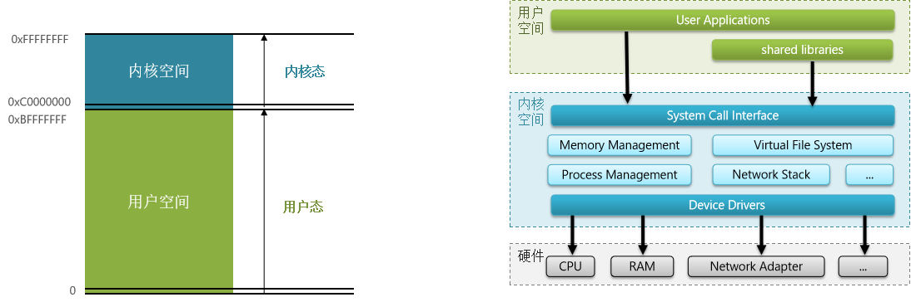
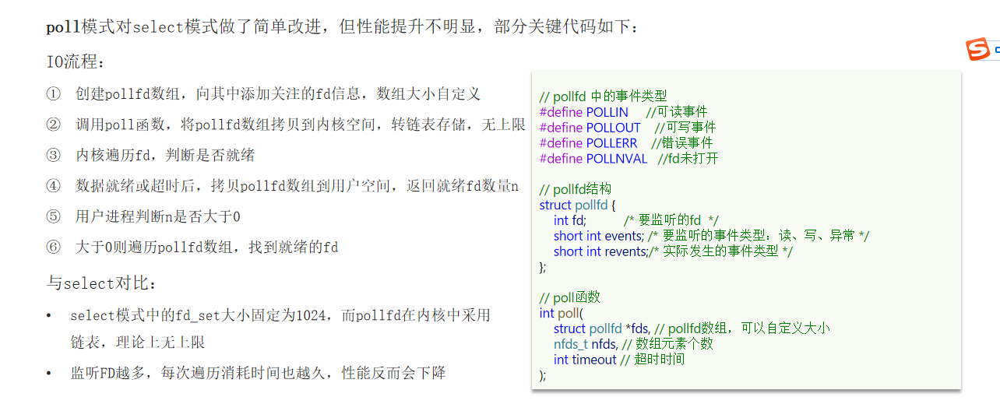

# 不屈日记

# redis原理

# 数据结构

## 动态字符串SDS

Redis是C语言实现的，其中SDS是一个结构体

```
struct __attribute__ ((__packed__)) sdshdr8 {
  uint8_t len; /* buf已保存的字符串字节数，不包含结束标示*/
  uint8_t alloc; /* buf申请的总的字节数，不包含结束标示*/
  unsigned char flags; /* 不同SDS的头类型，用来控制SDS的头大小
  char buf[];
};

flags对应的值
#define SDS_TYPE_5 0
#define SDS_TYPE_8 1
#define SDS_TYPE_16 2
#define SDS_TYPE_32 3
#define SDS_TYPE_64 4
```


SDS也叫动态字符串，动态扩容能力。

* 如果新字符串小于1M，则新空间为扩展后字符串长度的两倍+1。
* 如果新字符串大于1M，则新空间为扩展后字符串长度+1M+1.称为内存预分配。

优点：

* 获取字符串长度的时间复杂度
* 支持动态扩容
* 减少内存分配次数
* 二进制安全

## IntSet

IntSet是redis中set集合的一种实现方式，基于整数数组来实现，并且具备长度可变、有序等特征。
结构为：

```
typedef struct intset {
  uint32_t encoding; /* 编码方式，支持存放16位、32位、64位整数*/
  uint32_t length; /* 元素个数 */
  int8_t contents[]; /* 整数数组，保存集合数据*/
} intset;

/* Note that these encodings are ordered, so:
 * INTSET_ENC_INT16 < INTSET_ENC_INT32 < INTSET_ENC_INT64. 
 * 存储整数大小不同
 */
#define INTSET_ENC_INT16 (sizeof(int16_t)) /* 2字节整数，范围类似java的short*/
#define INTSET_ENC_INT32 (sizeof(int32_t)) /* 4字节整数，范围类似java的int */
#define INTSET_ENC_INT64 (sizeof(int64_t)) /* 8字节整数，范围类似java的long */


```

为了方便查找，redis会将intset中所有的整数按照升序一次保存在contents数组中

Intset可以看作是特殊的整数数组，具备一下特点：

1) redis会确保Intset中的元素唯一、有序
2) 具备类型升级机制，可以节省内存空间
3) 底层采用二分查找方式来查询

## Dict

```
typedef struct dictht {
    // entry数组
    // 数组中保存的是指向entry的指针
  dictEntry **table; 
    // 哈希表大小
  unsigned long size;   
    // 哈希表大小的掩码，总等于size - 1
    unsigned long sizemask;   
    // entry个数
    unsigned long used; 
} dictht;


typedef struct dictEntry {
  void *key; // 键
  union {
    void *val;
    uint64_t u64;
    int64_t s64;
    double d;
  } v; // 值
    // 下一个Entry的指针
  struct dictEntry *next; 
} dictEntry;


typedef struct dictht {
    // entry数组
    // 数组中保存的是指向entry的指针
  dictEntry **table; 
    // 哈希表大小
  unsigned long size;   
    // 哈希表大小的掩码，总等于size - 1
    unsigned long sizemask;   
    // entry个数
    unsigned long used; 
} dictht;


typedef struct dictEntry {
  void *key; // 键
  union {
    void *val;
    uint64_t u64;
    int64_t s64;
    double d;
  } v; // 值
    // 下一个Entry的指针
  struct dictEntry *next; 
} dictEntry;

```
Dict的结构：

* 类似java的HashTable,底层是数组加链表来解决哈希冲突
* Dict包含两个哈希表，ht[0]常用，ht[1]用来rehash

Dict的伸缩：
* 当LoadFactor大于5或者LoadFactor大于1并且没有子进程任务时，Dict扩容
* 当LoadFactor小于0.1时，Dict收缩
* 扩容大小为第一个大于等于used+1的2ⁿ
* 收缩大小为第一个大于等于used的2ⁿ
* Dict采用渐进式rehash，每次访问Dict时执行一次rehash
* rehash时ht[0]只减不增，新增操作只在ht[1]执行，其他操作在两个哈希表

## ZipList

ZipList特性：
* 压缩列表可以看做一种连续内存空间的双向链表
* 列表的节点之间不是通过指针连接，而是记录上一节点和本节点长度来寻址，内存占用较低
* 如果列表数据过多，导致链表过长，可能影响查询功能
* 增删较大数据时有可能发生连续更新问题


## QuickList
特点：

* 一个节点为ZipList的双端链表
* 节点采用ZipList,解决了创痛链表的内存占用问题
* 控制了ZipList大小，解决连续内存空间申请效率问题
* 中间节点可以压缩，进一步节省了内存


## SkipList

* 跳跃表是一个双向链表，每个节点都包含score和ele值
* 节点按照score值排序，score值一样则按照ele字典排序
* 每个节点都可以包含多层指针，层数是1到32之间的随机数
* 不同层指针到下一个节点的跨度不同，层级越高，跨度越大
* 增删改查效率与红黑树基本一致


## RedisObject

redis中的任意数据类型的键和值都会被封装为一个RedisObject，也叫做redis对象


## 五种数据结构
### String

String是Redis中最常见的数据存储类型

其基本编码方式是RAW，基于简单动态字符串实现，存储上限为512mb。
如果存储的SDS长度小于44字节，则会采用EMBSTR编码，此时object head与SDS是一段连续空间。申请内存是只需要调用一次内存分配函数，效率更高。
如果存储的字符串是整数值，并且大小在LONG_MAX范围内，则采用INT编码：直接将数据保存在redisObject的ptr指针位置，不再需要SDS

### List

Redis的List结构类似一个双向链表，可以从首、尾操作列表中的元素


### Set

Set是Redis中的集合，不一定确保元素有序，可以满足元素唯一、查询效率要求极高。
* 为了查询效率和唯一性，set采用HT编码。Dict中的key用来存储元素，value统一为null。
* 当存储的所有数据都是整数，并且元素数量不超过set-max-intset-entries时，set采用intset编码，以节省内存。


ZSet也就是SortedSet，其中每一个元素都需要指定一个score值和member值
* 可以根据score值排序
* member必须唯一
* 可以根据member查询分数


当元素数量不多时，HT和SkipList的优势不明显，而且更耗内存。因此zset还会采用ZipList结构来节省内存。满足两个条件
* 元素数量小于zset_max_ziplist_entries,默认值为128
* 每个元素都小于zset_max_ziplist_value字节，默认值为64

ziplist本省没有排序功能，而且没有键值对的概念，因此需要有zset通过编码实现：
* ZipList是连续内存，因此score和element是紧挨在一起的两个entry，element在前，score在后
* score越小越接近队首，score越大越接近队尾，按照score值升序排列


### Hash
Hash底层采用的编码与Zset基本一致
* Hash结构默认采用ZipList编码，节省内存，ZipList相邻的两个entry分别保存field和value
* 当数据量较大时，Hash结构会转为HT编码
  * ZipList中的元素数量超过了hash-max-ziplist-entries默认512
  * ZipList中的任意entry大小超过hash-max-ziplist-value默认为64字节


# 网络模型

## 用户空间和内核空间
为了避免用户应用导致冲突甚至内核崩溃，用户应用于内核是分离的

* 进程的寻址空间会划分为两个部分：内核空间、用户空间
* 用户空间只能执行受限的命令R3，而且不能直接调用系统资源，必须通过内核提供的接口来访问
* 内核空间可以执行特权命令，调用一切系统资源



Linux系统为了提高IO效率，会在用户空间和内核空间都加入缓冲区
* 写数据时，要把用户缓冲数据拷贝到内核缓冲区，然后写入设备
* 读数据时，要从设备读取数据到内核缓冲区，然后拷贝到用户缓冲区


## 阻塞IO

阻塞IO是两个阶段都必须阻塞等待：
* 阶段一
  * 用户进程尝试读取数据
  * 此时数据尚未到达，内核需要等待数据
  * 此时用户进程也处于阻塞状态
* 阶段二
  * 数据到达并拷贝到内核缓冲区，代表已就绪
  * 将内核数据拷贝到用户缓冲区
  * 拷贝过程中，用户进程依然阻塞等待
  * 拷贝完成，用户进程解决阻塞，处理数据


## 非阻塞IO

非阻塞IO的recvfrom操作会立即返回结果而不是阻塞用户进程

阶段一：
* 用户进程尝试读取数据
* 此时数据尚未到达，内核需要等待数据
* 返回异常给用户进程
* 用户进程拿到error后，再次尝试读取
* 循环往复，直到数据就绪

阶段二：
* 将内核数据拷贝到用户缓冲区
* 拷贝过程中，用户进程依然阻塞等待
* 拷贝完成，用户进程解决阻塞，处理数据
可以看到，非阻塞IO模型中，用户进程在第一个阶段是非阻塞，第二个阶段是阻塞状态。虽然是非阻塞，但性能没有得到提高。而且会导致CPU空转，CPU使用率暴增。
## IO多路复用

文件描述符（FD）：是一个从0开始的无符号整数，用来关联Linux中的每一个文件，在Linux中，一切皆文件，例如常规文件、视频、硬件设备，当然也包括网络套接字(Socket)

IO多路复用：是利用单个线程来同时监听多个FD，并在某个FD可读、可写时得到通知，从而避免无效的等待，充分利用CPU资源。

阶段一：
* 用户进程调用select，指定要监听的FD集合
* 内核监听FD对应的多个socket
* 任意一个或多个socket数据就绪则返回readable
* 此过程中用户进程阻塞

阶段二：
* 用户进程找到就绪的socket
* 依次调用recvfrom读取数据
* 内核将数据拷贝到用户空间
* 用户进程处理数据


IO多路复用是利用单个线程来同时监听多个FD，并在FD可读、可写时得到通知，从而避免无效的等待，充分利用CPU资源。不过监听FD的方式、通知的方式又有多种实现。
* select
* poll
* epoll

差异：
* select和poll只会通知用户进程有FD就绪，但不确定具体是哪个FD，需要用户进程逐个遍历FD来确认
* epoll则会通知用户进程FD就绪的同时，把已就绪的FD写入用户空间

select：


poll：



epoll:


select模式存在的三大问题：
* 能监听的FD最大不超过1024
* 每次select都需要把所有要监听的FD都看拷贝到内核空间
* 每次都要遍历所有的FD来判断就绪状态

poll模式的问题：
* poll利用链表解决了select中监听FD上限的问题，但依然要遍历所有FD，如果监听较多，性能会下降

epoll模式中：
* 基于epoll实例中的红黑树保存到监听的FD，理论上无上限，而且增删改查效率都非常高
* 每个FD只需要执行一次epoll_ctl添加到红黑树，以后每次epoll_wait无需传递任何参数，无需重复拷贝FD到内核空间
* 利用ep_poll_callback机制来监听FD状态，无需遍历所有FD

IO多路复用-事件通知机制
当FD有数据可读时，我们调用epoll_wait可以得到通知，但是事件通知的模式有两种
* LevelTriggered：水平触发。只要某个FD中有数据可读，每次调用epoll_wait都会得到通知
* EdgeTriggered：边沿触发。只有在某个FD有状态变化时，调用epoll_wait才会被通知

IO多路复用-web服务流程


## 信号驱动IO


## 异步IO


### 同步和异步比较


## Redis网络模型

Redis是单线程或者多线程？

* 核心业务是单线程，整个redis核心网络部分是多线程
* IO多路复用，epoll

redis核心业务为什么是单线程？

* redis是纯内存操作，执行速度非常快，它的性能瓶颈是网络延迟而不是执行速度，因此多线程并不会带来巨大的性能提升
* 多线程导致过大的上下文切换
* 引入多线程而面临线程安全问题，必然要引入线程锁这样的安全手段，实现复杂度增高，而且性能也会降低

# 通信协议

RESP协议-数据类型

# 内存策略
maxmemory 1gb
## 过期策略

利用两个DICT记录key-value以及key-ttl

过期删除策略

* 惰性删除，当访问时删除
* 定期删除，周期性部分过期key，执行删除
  * 定时任务，按照server.hz评率删除，模式为slow，执行频率默认为10，每次不超过25ms
  * 每个事件循环前调用beforeSleep()函数，执行过期key清理，模式为Fast，频率不固定，但两次间隔不低于2ms，每次耗时不超过1ms
## 内存淘汰

内存淘汰：就是redis内存使用达到设置的上限时，主动挑选部分key删除以释放更多内存。

Redis支持8种不同策略来选择要删除的key：
* noeviction： 不淘汰任何key，但是内存满时不允许写入新数据，默认就是这种策略。
* volatile-ttl： 对设置了TTL的key，比较key的剩余TTL值，TTL越小越先被淘汰
* allkeys-random：对全体key ，随机进行淘汰。也就是直接从db->dict中随机挑选
* volatile-random：对设置了TTL的key ，随机进行淘汰。也就是从db->expires中随机挑选。
* allkeys-lru： 对全体key，基于LRU算法进行淘汰
* volatile-lru： 对设置了TTL的key，基于LRU算法进行淘汰
* allkeys-lfu： 对全体key，基于LFU算法进行淘汰
* volatile-lfu： 对设置了TTL的key，基于LFI算法进行淘汰


LRU算法：now-最后一次使用时间
LFU算法：使用频率，（最后一次使用时间+频率），频率进行计算


