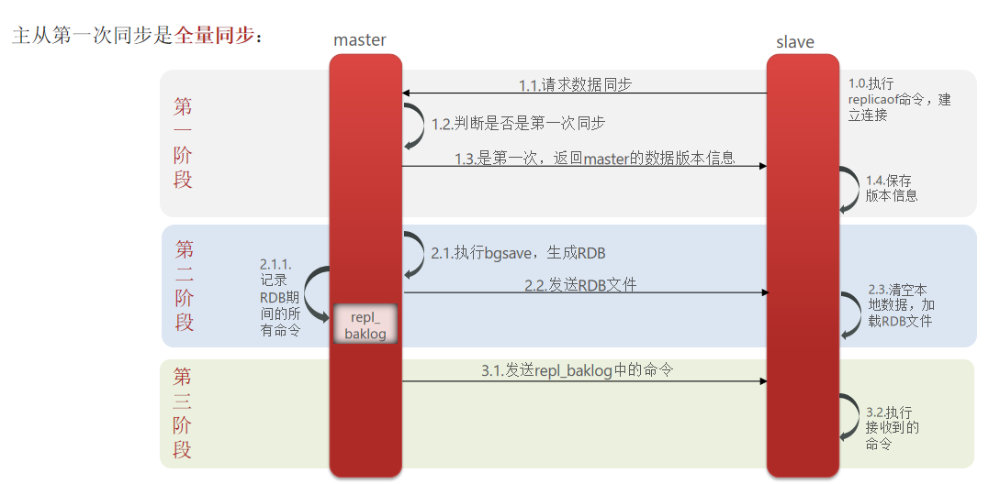
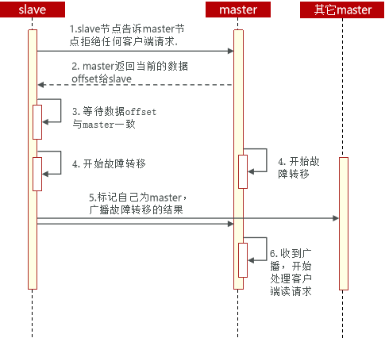

# 不屈日记

---
## 短信登录-redis项目

---
### session共享问题：

多台tomcat并不共享session存储空间，当请求切换到不同tomcat服务时，导致数据丢失问题。
替代方案：
> * 数据共享
> * 内存存储
> * key.value结构

---
### Redis替换session需要考虑的问题

> * 选择合适的数据结构
> * 选择合适的key
> * 选择合适的存储粒度

---

### 缓存

缓存就是数据交换的缓冲区，是存储数据的临时地方，一般读写性能较高
#### 作用

* 降低后端负载
* 提高读写效率，降低响应时间
#### 成本

* 数据一致性成本
* 代码维护成本
* 运维成本
---
### 缓存更新问题


 1                                                | 内存淘汰                                            | 超时剔除                             | 主动更新
--------------------------------------------|-------------------------------------------------|----------------------------------|----------------------------------
 说明| 不用自己维护，利用Redis的内存淘汰机制，当内存不足时自动淘汰部分数据。下次查询时更新缓存。 | 给缓存数据添加TTL时间，到期后自动删除缓存。下次查询时更新缓存 | 编写业务逻辑，在修改数据库的同时，更新缓存
 一致性| 差                                               | 一般                               | 好
维护成本| 无                                               | 低                                |高

业务场景：
+ 低一致性需求：使用内存淘汰机制。
+ 高一致性需求：主动更新，并以超时

---

### 缓存穿透

> 缓存穿透是指客户端请求的数据在缓存中和数据库中都不存在，这样缓存永远不会生效，这些请求都会打到数据库。  

缓存空对象：  
    优点：实现简单，维护方便  
    缺点：  
* 额外的内存消耗
* 可能造成短期的不一致

布隆过滤器：
* 优点：内存占用少，没有多余key
* 缺点：实现复杂，存在误判可能

### 缓存雪崩

> 缓存雪崩是指在同一时间段大量的缓存key同时失效或者Redis服务宕机，导致大量请求到达数据库，带来巨大压力

解决方案：
* 给不同的可以TTL添加随机值
* 利用redis集群提高服务的可用性，主从集群，哨兵模式
* 给缓存业务添加降级限流策略
* 给业务添加多级缓存。caffine

### 缓存击穿
> 缓存击穿问题也叫热点key问题，就是一个被高并发访问并且缓存重建业务较复杂的可以突然失效了，无数的请求访问在瞬间给数据库带来巨大的冲击。

解决方案：
> 互斥锁和逻辑过期

解决方案 |优点|缺点
---- |------------------------------------------| ------
互斥锁  | <li>没有额外的消耗</li><li>保证一致性</li<li>实现简单</li> | <li>现成需要等待，性能受影响</li><li>可能有死锁风险</li>
逻辑过期  | <li>现成无需等待，性能较好</li>                     | <li>不保证一致性</li><li>有额外内存消耗</li><li>实现复杂</li>

### 全局唯一ID
> 全局ID生成器，是一种分布式系统下用来生成全局唯一ID的工具，一般要满足。redis生成得的ID
* 高可用
* 唯一性
* 高性能
* 递增性
* 安全性


> 雪花算法
> com.baomidou.mybatisplus.core.toolkit.Sequence
> com.hmdp.utils.SnowflakeIdGenerator




### 分布式锁

> 分布式锁：满足分布式系统或集群模式下多进程可见并且互斥的锁。

* 多进程可见
* 互斥
* 高可用
* 高性能
* 安全性

实现方案：mysql、Redis、Zookeeper
* mysql互斥锁
* setnx命令
* zookeeper节点，有序性，唯一性


### Redis的Lua脚本

> Redis提供了lua脚本功能，在一个脚本中编写多条Redis命令，确保多条命令执行时的原子性。Lua是一种编程语言。

### 基于redis的分布式锁实现思路

> * 利用set nx ex 获取锁，并设置过期时间，保存线程标识
> * 释放锁时先判断线程标识是否与自己一致，一致则删除锁

### 特性：
> * 利用set nx满足互斥性
> * 利用set ex保证故障时锁依然能释放，避免死锁，提高安全性
> * 利用redis集群保证高可用和高并发特性

#### 存在问题
> * 不可重入
> * 不可重试
> * 超时释放
> * 主从一致性

### Redission分布式锁原理
* 可重入： 利用hash结构记录线程ID和重入次数
* 可重试： 利用信号量和PubSub功能实现等待、唤醒，获取锁失败的重试机制
* 超时续约： 利用watchDog，每隔一段时间，重置超时时间


### 不可重入redis分布式锁
+ 原理：利用setnx的互斥性；利用ex避免死锁；锁释放判断线程标识
+ 缺陷：不可重入，无法重试，锁超时失效

### 可重入的redis分布式锁
+ 原理： 利用hash结构，记录线程标识和重入次数；利用watchDog延续锁时间；利用信号量控制锁重试等待
+ 缺陷： redis宕机引起锁失效问题

### redisson的multilock
+ 原理：多个独立的redis节点，必须在所有节点都获取重入锁，才算获取锁成功
+ 缺陷：成本比较高，实现方案复杂

```java


```

### 可重入锁原理

### 分布式锁原理


### 消息队列
消息队列字面意思就是存放消息的队列。
* 消息队列：存储和管理消息
* 生产者：发送消息到消息队列
* 消费者：从消费队列中获取消息并处理消息

### 基于List的消息队列
> 通过BRPUSH和BLPOP命令实现阻塞队列

优点：  
* 利用redis存储，不受JVM内存限制
* 基于Redis的持久化机制，数据安全有保证
* 可以满足消息有序性  

缺点：
* 无法避免消息丢失
* 只支持单消费者

### redis发布订阅模型
PubSub是redis版本引入的消息传递模型。
* SUBSCRIBE channel [channel]:订阅一个活多个频道
* PUBLISH channel msg:向一个频道发送消息
* PSUBSCRIBE pattern [pattern]：订阅与pattern格式匹配的所有频道  

优点：
* 支持多生产、多订阅

缺点：
* 不支持数据持久化
* 无法避免消息丢失
* 消息堆积有上限，超出时数据丢失

### stream消息队列
stream是非常完善的消息队列。  
xadd xread
* 消息可回溯
* 一个消息可以被多个消费者读取
* 可以阻塞读取
* 有消息漏读的风险
### 基于stream的消息队列-消费者组
XGROUP XREADGROUP
消费者组：将多个消费者划分为一个组中，监听同一个队列。
* 消息分流
* 消息标示
* 消息确认

[主从同步图](https://www.processon.com/diagraming/6603ef7a98e2b2744cc64ee0)

---