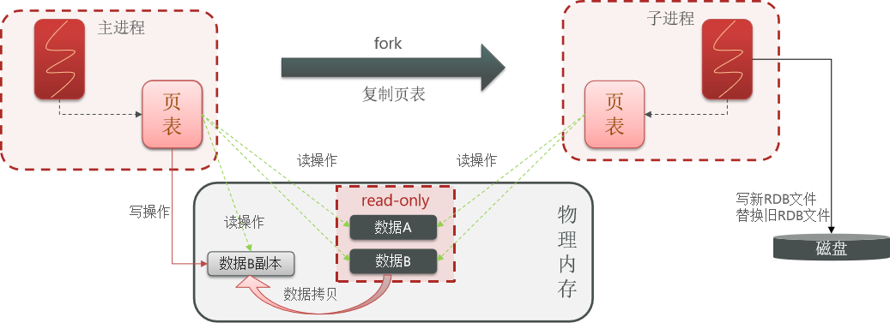

# 不屈日记

---
## 短信登录-redis项目

---
### session共享问题：

多台tomcat并不共享session存储空间，当请求切换到不同tomcat服务时，导致数据丢失问题。
替代方案：
> * 数据共享
> * 内存存储
> * key.value结构

---
### Redis替换session需要考虑的问题

> * 选择合适的数据结构
> * 选择合适的key
> * 选择合适的存储粒度

---

### 缓存

缓存就是数据交换的缓冲区，是存储数据的临时地方，一般读写性能较高
#### 作用

* 降低后端负载
* 提高读写效率，降低响应时间
#### 成本

* 数据一致性成本
* 代码维护成本
* 运维成本
---
### 缓存更新问题


 1                                                | 内存淘汰                                            | 超时剔除                             | 主动更新
--------------------------------------------|-------------------------------------------------|----------------------------------|----------------------------------
 说明| 不用自己维护，利用Redis的内存淘汰机制，当内存不足时自动淘汰部分数据。下次查询时更新缓存。 | 给缓存数据添加TTL时间，到期后自动删除缓存。下次查询时更新缓存 | 编写业务逻辑，在修改数据库的同时，更新缓存
 一致性| 差                                               | 一般                               | 好
维护成本| 无                                               | 低                                |高

业务场景：
+ 低一致性需求：使用内存淘汰机制。
+ 高一致性需求：主动更新，并以超时

---

### 缓存穿透

> 缓存穿透是指客户端请求的数据在缓存中和数据库中都不存在，这样缓存永远不会生效，这些请求都会打到数据库。  

缓存空对象：  
    优点：实现简单，维护方便  
    缺点：  
* 额外的内存消耗
* 可能造成短期的不一致

布隆过滤器：
* 优点：内存占用少，没有多余key
* 缺点：实现复杂，存在误判可能

### 缓存雪崩

> 缓存雪崩是指在同一时间段大量的缓存key同时失效或者Redis服务宕机，导致大量请求到达数据库，带来巨大压力

解决方案：
* 给不同的可以TTL添加随机值
* 利用redis集群提高服务的可用性，主从集群，哨兵模式
* 给缓存业务添加降级限流策略
* 给业务添加多级缓存。caffine

### 缓存击穿
> 缓存击穿问题也叫热点key问题，就是一个被高并发访问并且缓存重建业务较复杂的可以突然失效了，无数的请求访问在瞬间给数据库带来巨大的冲击。

解决方案：
> 互斥锁和逻辑过期

解决方案 |优点|缺点
---- |------------------------------------------| ------
互斥锁  | <li>没有额外的消耗</li><li>保证一致性</li<li>实现简单</li> | <li>现成需要等待，性能受影响</li><li>可能有死锁风险</li>
逻辑过期  | <li>现成无需等待，性能较好</li>                     | <li>不保证一致性</li><li>有额外内存消耗</li><li>实现复杂</li>

### 全局唯一ID
> 全局ID生成器，是一种分布式系统下用来生成全局唯一ID的工具，一般要满足。redis生成得的ID
* 高可用
* 唯一性
* 高性能
* 递增性
* 安全性



> 雪花算法
> com.baomidou.mybatisplus.core.toolkit.Sequence
> com.hmdp.utils.SnowflakeIdGenerator


### 分布式锁

> 分布式锁：满足分布式系统或集群模式下多进程可见并且互斥的锁。

* 多进程可见
* 互斥
* 高可用
* 高性能
* 安全性

实现方案：mysql、Redis、Zookeeper
* mysql互斥锁
* setnx命令
* zookeeper节点，有序性，唯一性


### Redis的Lua脚本

> Redis提供了lua脚本功能，在一个脚本中编写多条Redis命令，确保多条命令执行时的原子性。Lua是一种编程语言。

### 基于redis的分布式锁实现思路

> * 利用set nx ex 获取锁，并设置过期时间，保存线程标识
> * 释放锁时先判断线程标识是否与自己一致，一致则删除锁

### 特性：
> * 利用set nx满足互斥性
> * 利用set ex保证故障时锁依然能释放，避免死锁，提高安全性
> * 利用redis集群保证高可用和高并发特性

#### 存在问题
> * 不可重入
> * 不可重试
> * 超时释放
> * 主从一致性

### Redission分布式锁原理
* 可重入： 利用hash结构记录线程ID和重入次数
* 可重试： 利用信号量和PubSub功能实现等待、唤醒，获取锁失败的重试机制
* 超时续约： 利用watchDog，每隔一段时间，重置超时时间


### 不可重入redis分布式锁
+ 原理：利用setnx的互斥性；利用ex避免死锁；锁释放判断线程标识
+ 缺陷：不可重入，无法重试，锁超时失效

### 可重入的redis分布式锁
+ 原理： 利用hash结构，记录线程标识和重入次数；利用watchDog延续锁时间；利用信号量控制锁重试等待
+ 缺陷： redis宕机引起锁失效问题

### redisson的multilock
+ 原理：多个独立的redis节点，必须在所有节点都获取重入锁，才算获取锁成功
+ 缺陷：成本比较高，实现方案复杂

```java


```

### 可重入锁原理

### 分布式锁原理


### 消息队列
消息队列字面意思就是存放消息的队列。
* 消息队列：存储和管理消息
* 生产者：发送消息到消息队列
* 消费者：从消费队列中获取消息并处理消息

### 基于List的消息队列
> 通过BRPUSH和BLPOP命令实现阻塞队列

优点：  
* 利用redis存储，不受JVM内存限制
* 基于Redis的持久化机制，数据安全有保证
* 可以满足消息有序性  

缺点：
* 无法避免消息丢失
* 只支持单消费者

### redis发布订阅模型
PubSub是redis版本引入的消息传递模型。
* SUBSCRIBE channel [channel]:订阅一个活多个频道
* PUBLISH channel msg:向一个频道发送消息
* PSUBSCRIBE pattern [pattern]：订阅与pattern格式匹配的所有频道  

优点：
* 支持多生产、多订阅

缺点：
* 不支持数据持久化
* 无法避免消息丢失
* 消息堆积有上限，超出时数据丢失

### stream消息队列
stream是非常完善的消息队列。  
xadd xread
* 消息可回溯
* 一个消息可以被多个消费者读取
* 可以阻塞读取
* 有消息漏读的风险
### 基于stream的消息队列-消费者组
XGROUP XREADGROUP
消费者组：将多个消费者划分为一个组中，监听同一个队列。
* 消息分流
* 消息标示
* 消息确认

### bitmap
SETBIT 和 GETBIT  

### UV和PV
> UV是独立访客量，通过互联网访问、浏览这个网页的自然人。
> PV是PageView，页面访问量，用户每访问网站的一个页面。  
HyperLoglog命令  
> PFADD 添加  重复元素只有一次
> PFCOUNT 计数  
> PFMERGE 合并

### RDB
RDB称为数据备份文件，即数据快照。当redis发生故障后，从磁盘中读取快照文件，恢复数据。  
执行save、bgsave会进行保存RDB文件操作。  
redis宕机会自动进行一次RDB。  
redis.conf  
```
save 900 1
save 300 10
save 60 10000
# 是否压缩，建议不开启，压缩也会消耗cpu
rdbcompression yes
#RDB文件名称
dbfilename dump.rdb
#文件保存的路径目录
dir ./  
```


```
bgsave时，主进程会fork主进程得到子进程，子进程共享主进程的虚拟内存。完成fork后读取内存数据将数据
写入RDB文件。用新RDB文件替换旧的RDB文件。
fork采用的是copy-on-write技术。
当主进程执行读操作的时候，读取共享内存。
当主进程执行写操作时，会拷贝一份数据，执行写操作。

RDB在服务器宕机或者打到key修改次数会触发bgsave操作。

缺点：
RDB执行间隔时间长，两次RDB有丢失数据的风险。
fork子进程、压缩、写入RDB文件都比较耗时。
```
### AOF
```
AOF全程为Append Only File.Redis每一个写命令都会记录在AOF文件。
AOF默认是关闭的。可以开启通过
appendonly yes
applendfilename 'appendonly.aof'
AOF记录的频率：
每一次命令，立即记录。 appendfsync always
每隔一秒就将缓存区数据写入到AOF文件 appendfsync everysec
写命令执行完毕放入缓存区，由操作系统决定何时写入文件。 appendfsync no

通过执行bgrewriteof，可以让AOF文件执行重写功能，用最少的命令达到相同的效果。
重写AOF文件：
# AOF文件比上次文件 增长超过多少百分比则触发重写
auto-aof-rewrite-percentage 100
auto-aof-rewrite-min-size 64mb
```
 配置项  | 刷盘时机   | 优点           |缺点
 ---- |---|--------------| ------
 Always  | 同步刷盘   | 可靠性高，几乎不丢失数据 | 性能影响大
 everysec  | 每秒刷盘   | 性能适中         | 最多丢失1秒数据
 no  | 操作系统控制 | 性能最好         | 可靠性较差，可能丢失大量数据

### AOF和RDB对比
 名称  |                     RDB | AOF          
 ----: |------------------------:|--------------:
 持久化方式  |                    数据快照 | 记录每一个命令 
 数据完整性  |         不完整，两次RDB可能丢失数据 | 相对完整，取决于刷盘策略         
 文件大小  |              会有压缩，文件体积小 | 记录命令，文件体积大
 宕机恢复速度  |                      很快 | 慢
 数据恢复优先级|              低，完整性不如AOF | 高，数据完整性更高
 系统资源占用  |            高，大量cpu和内存消耗 | 低，主要是磁盘消耗，执行重写命令会占用大量内存和cpu
 使用场景  |  可以容忍数分钟的数据丢失，追求更高的启动速度 | 对数据安全性要求较高常见

### 主从集群数据同步原理 和增量同步

注意：  
> repl_baklog大小有上限，写满后会覆盖最早期的数据。如果slave断开时间过久，导致尚未备份的数据被覆盖，则无法基于log
> 做增量同步，只能再次全量同步

```
优化主从集群：
在master中配置repl-diskless-sync yes启动无磁盘复制，避免全量同步时的磁盘IO。
redis单节点上的内存占用不要太大，减少RDB导致的过多磁盘IO。
适当提高repl_baklog的大小，发现slave宕机时，尽快实现故障恢复，尽可能避免全量同步。
限制一个master上的slave节点数量，如果实在是太多slave，则可以采用主-从-从链式结构，减少master压力。

```
[主从同步图](https://www.processon.com/diagraming/6603ef7a98e2b2744cc64ee0)

### 哨兵模式
```
哨兵模式：实现主从集群的自动故障恢复。
监控：检查主从节点的工作状态。
故障恢复：master宕机，将一个slave提升为master。故障恢复以后，也是以新的master为主节点。
通知：sentinel将集群信息发送给redis的客户端。

服务状态监控：
sentinel基于心跳机制检测服务状态。每隔一秒向集群的每一个实例发送ping命令
主观下线：如果单个sentinel节点发现某个redis未在规定时间响应，则认为该实例主观下线。
客观下线：若超过指定数量的sentinel都认为该实例主观下线，则该实例客观下线。quorum值最好超过sentinel实例数量一般。

选举新的master：
一旦发现master故障，sentinel需要在slave中选择一个作为新的master
1.判断slave节点和master节点断开时间长短，如果超过指定值（down-after-milliseconds*10）则会排除该slave节点
2.判断slave节点的slave-priority值，越小优先级越高，如果是0则永不参与选举
3.如果slave-prority一样，则判断offset，越大说明数据越新，优先级越高
4.判断slave节点的id大小，越小优先级越高

实现故障转移：
1.sentinel给备选的slave1节点发送slaveof no one 命令，该节点成为master
2.sentinel给所有其他slave发送slaveof命令，让这些slave成为新master从节点，开始同步数据
3.sentinel将故障节点标记为slave，当故障恢复后会自动成为新的master的slave节点
```

### 分片集群

redis会把每一个master节点映射到0-16383共16384个插槽，查看集群信息时就能看到。

集群连接命令

`redis-cli -c -p 7001`

`redis-cli --cluster add-node`

`redis-cli --cluster help`

`redis-cli --cluster reshard`

故障转移

* 首先该实例与其他实例失去连接
* 疑似宕机
* 确认下线，自动提升一个slave为新的master

数据迁移

利用cluster failover命令可以手动让集群中的某个master宕机，切换到执行cluster failover命令的这个slave节点，实现无感知的数据迁移。

三种不同的模式：
* 缺省：默认流程
* force：省略了对offset的一致性校验
* takeover：直接执行，忽略数据一致性、忽略master状态和其他master的意见


---