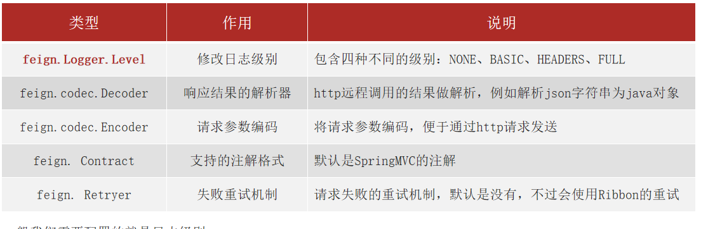

# 不屈日记

---

# springcloud组件

1) 服务注册 eurake和nacos
2) 远程调用 feign
3) 负载均衡 ribbon
4) 熔断降级 hystrx
5) 服务监控 skywalking、
6) 网管 zuul和gateway
# 微服务概念

单体架构特点

简单方便，高度耦合，扩展性差，适合小型项目

分布式架构特点

松耦合，扩展性好，但架构复杂，难度大，适合大型互联网项目

微服务

* 优点：拆分粒度更小、服务更独立、耦合度更低
* 缺点：架构非常复杂、运维、监控、部署难度提高

微服务组件

# eureka注册中心

消费者获取提供者注册信息
* 服务提供者启动时将eureka注册自己
* eureka保存信息
* 消费者根据服务名向eureka拉取提供者信息

服务消费者利用负载均衡算法
* 服务提供者每隔30秒向eurekaServer发送心跳信息，报告健康状态
* eureka会更新服务列表信息，心跳不正常会剔除
* 消费者拉取最新的信息

# ribbon负载均衡原理

Ribbon负载均衡规则：
* 规则接口是IRule
* 默认实现是ZoneAvoidanceRule，根据zone选择服务列表，然后轮询

负载均衡自定义：
* 代码方式：配置灵活
* 配置方式，无需重新打包发布，但是无法做到全局配置

饥饿加载
* 开启饥饿加载
* 指定饥饿加载的微服务名称

# nacos注册中心

Nacos启动命令   start.cmd -m standalone

NacolsRule负载均衡策略
* 优先选择同集群服务实例
* 本地集群找不到提供者，才会其他集群寻找，并且会报警
* 确定了可用实例列表后，再采用随机负载均衡挑选实例

实例的权重控制
* Nacos控制台可以设置实例的权重值，0~1之间
* 同集群内的多个实例，权重越高被访问的评率越高
* 权重设置为0则完全不会被访问

Nacos环境隔离
* namespace用来做环境隔离
* 每个namespace都有唯一ID
* 不同namespace下的服务不可见

Eureka和nacos共同点
* 都支持服务注册和服务发现
* 都支持服务提供者心跳方式健康检测

Nacos和Eureka的区别
* Nacos支持服务端主动检测提供者状态，临时实例采用心跳模式，非临时实例采用主动检测模式
* 临时实例心跳不正常会剔除，非临时实例则不会剔除
* Nacos支持服务列表变更的消息推送模式，服务列表更新及时
* Nacos集群默认采用AP方式，当集群中存在非临时实例时，采用CP模式；Eureka采用AP方式

Nacos配置管理步骤
* 在nacos中添加配置文件
* 在位服务中引入nacos的config依赖
* 在微服务中添加bootstrap.yml，配置nacos地址

Nacos配置自动刷新两种方式
* @RefreshScope
* @ConfigurationProperties

Nacos多环境配置共享问题
* [服务名]-[spring.profile.action].yaml，环境配置
* [服务名].yaml，默认配置，多环境共享
* [服务名]-[环境].yaml>[服务名].yaml>本地配置

集群搭建：
* 搭建MySQL集群并初始化数据库表
* 下载解压nacos
* 修改集群配置、数据库配置
* 分别启动多个nacos节点
* nginx反向代理

Fegin使用步骤
* 引入依赖
* 添加@EnableFeginClients注解
* 编写FeignClient接口
* 使用FeginClient中定义的方法替代RestTemplate

自定义Feign的配置

Feign的日志配置：
* 方式一配置文件，feign.client.config.xxx.loggerLevel
  * 如果xxx是default则代表全局
  * 如果xxx是服务名称，代表某个服务
* 方式二java代码配置Logger.Level这个Bean
  * 如果在@EnableFeignClients注解声明则代表全局
  * 如果在@FeignClient注解中声明则代表某服务

Feign性能优化
* 日志级别尽量用basic
* 使用HttpClient或者OkHttp代替URLConnection
  * 引入feign-httpclient依赖
  * 配置文件开启httpClient功能

Feign最佳实践
* controller和feignClient继承同一接口
* 将FeignClient、pojo、feign的默认配置都定义到一个项目中，供消费者使用

网关的作用
* 对用户请求做身份认证、权限校验
* 将用户请求路由到微服务，并实现负载均衡
* 对用户请求做限流

网关搭建步骤：
* 引入nacos服务发现和gateway依赖
* 配置application.yml，包括基本信息、nacos地址、路由

路由配置包括：
* 路由ID
* 路由目标，http固定地址，lb代表负载均衡
* 路由断言：判断路由规则
* 路由过滤器：对请求和响应做出处理

PredicateFactory作用：
* 读取用户定义的断言条件，对请求做出判断

Path=/user/**
* 路径是以/user开头救人位符合

# 网关过滤器（gateway）

过滤器的作用
* 对路由的请求或者响应做加工处理
* 配置在路由下的过滤器只对当前路由的请求生效

defaultFilter的作用
* 对所有路由都生效的过滤器

全局过滤器
* 对所有路由都生效的过滤器，并且可以自定义处理逻辑

实现全局过滤器
* 实现GlobalFilter接口
* 添加@Order注解
* 编写处理逻辑

过滤器执行顺序
* 请求进入网关会碰到三类过滤器：当前路由的过滤器、DefaultFilter、GlobalFilter
* 请求路由后，会将当前路由过滤器和DefaultFilter、GlobalFilter，合并到一个过滤器链

路由过滤器、defaultFilter、全局过滤器的执行顺序
* order值越小、优先级越高
* 当order值一样时，顺序是defaultFilter最先，然后是局部的路由过滤器，最后是全局过滤器

跨域问题
* 配置允许那些域名跨域
* 允许那些请求头
* 允许那些请求方式
* 是否允许使用cookie
* 有效期多久

限流过滤器

限流：对应用服务器的请求做限制，避免因请求过多导致服务器过载或者宕机。
* 计数器算法，窗口计数器算法、滑动窗口算法。单位时间内计数器超过了限制数量
* 漏桶算法。以固定的速率生成令牌，如果令牌桶满了，则丢弃。请求进入后，必须先尝试从桶中获取令牌，获取令牌后才可以被处理，没有令牌请求等待或者丢弃
* 令牌桶算法

> 基于Filter的限流
> SpringCloudGateway官方就提供了基于令牌桶的限流支持。基于其内置的过滤器工厂
> RequestRateLimiterGatewayFilterFactory 实现。在过滤器工厂中是通过Redis和lua脚本结合的方式进行流量控制。

