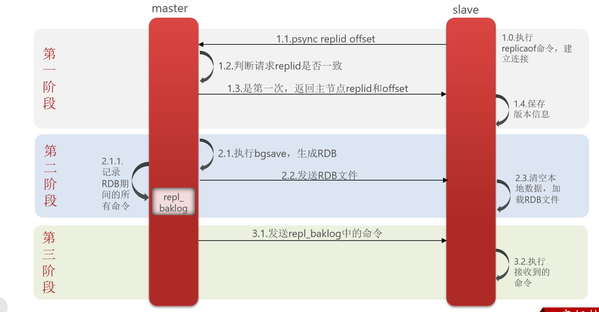

# 不屈日记

---

# springcloud组件

1) 服务注册 eurake和nacos
2) 远程调用 feign
3) 负载均衡 ribbon
4) 熔断降级 hystrx
5) 服务监控 skywalking、
6) 网管 zuul和gateway
# 微服务概念

单体架构特点

简单方便，高度耦合，扩展性差，适合小型项目

分布式架构特点

松耦合，扩展性好，但架构复杂，难度大，适合大型互联网项目

微服务

* 优点：拆分粒度更小、服务更独立、耦合度更低
* 缺点：架构非常复杂、运维、监控、部署难度提高

微服务组件

# eureka注册中心

消费者获取提供者注册信息
* 服务提供者启动时将eureka注册自己
* eureka保存信息
* 消费者根据服务名向eureka拉取提供者信息

服务消费者利用负载均衡算法
* 服务提供者每隔30秒向eurekaServer发送心跳信息，报告健康状态
* eureka会更新服务列表信息，心跳不正常会剔除
* 消费者拉取最新的信息

# ribbon负载均衡原理

Ribbon负载均衡规则：
* 规则接口是IRule
* 默认实现是ZoneAvoidanceRule，根据zone选择服务列表，然后轮询

负载均衡自定义：
* 代码方式：配置灵活
* 配置方式，无需重新打包发布，但是无法做到全局配置

饥饿加载
* 开启饥饿加载
* 指定饥饿加载的微服务名称

# nacos注册中心

